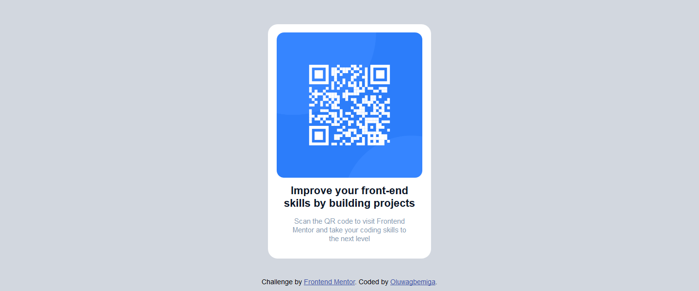

# Frontend Mentor - QR code component solution

Link to solution: 
https://genix-qrcode-solution.netlify.app

This is a solution to the [QR code component challenge on Frontend Mentor](https://www.frontendmentor.io/challenges/qr-code-component-iux_sIO_H). Frontend Mentor challenges help you improve your coding skills by building realistic projects. 

## Table of contents

- [Overview](#overview)
  - [Screenshot](#screenshot)
- [My process](#my-process)
  - [Built with](#built-with)
  - [What I learned](#what-i-learned)
  - [Continued development](#continued-development)
  - [Useful resources](#useful-resources)
- [Author](#author)
- [Acknowledgments](#acknowledgments)

## Overview

### Screenshot

## My process
- I started with the HTML by adding some custom HTML to the already written HTML starter code that was given to me. And then i started writing my CSS to add custom styling to my already written HTML to give it some great layout, and some responsiveness to add complexity.
- No Javascript was used in this code, just HTML and Pure CSS.
- While building this project i made use of my already learnt Flex-Box Knowledge, and it really helped me to lay out my elements from left to right and also top to bottom.
- I also added the CSS grid while i was coding as one of the layouts properties for styling.
- Before i finished this project, i got some reference from a youtuber named Kevin Powell who's really good at CSS. The reason i reached out to his video as a reference, was because i was having issues with responsiveness, and i also wanted my layout to look really good while i was coding.

### Built with

- Semantic HTML5 markup
- CSS custom properties
- Flexbox
- CSS Grid
- Started with the desktop view

### What I learned

- I learned CSS Grid, Flexbox Layouts, and mobile responsiveness, when doing this challenge.

If you want more help with writing markdown, we'd recommend checking out [The Markdown Guide](https://www.markdownguide.org/) to learn more.

### Continued development
In my future projects, i want to apply more of the CSS grid and Flexbox to make my layout look more beautiful, and not hard-coded.

### Useful resources

- [Learn CSS grid the easy way](https://www.youtube.com/watch?v=rg7Fvvl3taU) - This helped me for knowing how to use CSS Grid to structure my layout. I really loved this layout property and will use it going forward.
- [Learn flexbox the easy way](https://www.youtube.com/watch?v=u044iM9xsWU) - This is an amazing video by Kevin Powell which helped me finally understand Flexbox Concept and how to apply it to layouts. I'd recommend it to anyone still finding it hard to properly layout contents on their webpage.

## Author
- Frontend Mentor - [@JailBreak](https://www.frontendmentor.io/profile/JAILBREAK-101)
- Twitter - [@Oluwagbemiga](https://www.twitter.com/@GenixTech1)

## Acknowledgments

I acknowlegde Kevin Powell for his help on teaching me CSS Grid and Flexbox, and Kyle from Web Dev Simplified for contributing to my knowledge in Flexbox.
